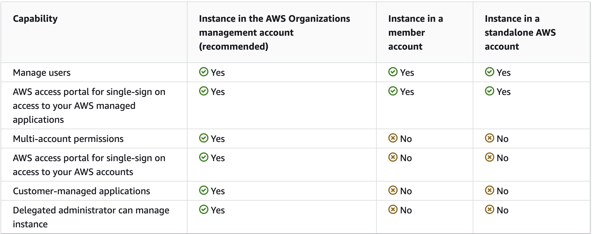

# Notes about setting up AWS IAM Identity Center programatically

Relevant AWS CLI functionality:
https://awscli.amazonaws.com/v2/documentation/api/latest/reference/identitystore/index.html
https://awscli.amazonaws.com/v2/documentation/api/latest/reference/sso-admin/index.html

## Optional: Export current AWS IAM identity center instance, users, groups, permission sets and relationship

* Leverage this [solution](https://aws.amazon.com/blogs/security/how-to-automate-the-review-and-validation-of-permissions-for-users-and-groups-in-aws-iam-identity-center/) to export users, group, permission sets, policies information and etc.
* Note: The solution is not meant for imports hence lacking some additional user data contexts such as family name, given name and others (not a critical blocker)
* Explore the new API https://docs.aws.amazon.com/singlesignon/latest/APIReference/API_ListAccountAssignmentsForPrincipal.html if that simplifies

Useful background info:
- There are two types of instances available for IAM Identity Center: organization instances and account instance. Choice of which will affect the capability that you want: [read more](https://docs.aws.amazon.com/singlesignon/latest/userguide/identity-center-instances.html)

## Steps to create programmatically (with AWS CLI)

### Use case: Migrating AWS IAM Identity Center instance from a management account to a new account (to be swapped as a management account with the existing being demoted to member account)

* If haven't already, enable creation of account instance in management account [link](https://docs.aws.amazon.com/singlesignon/latest/userguide/enable-account-instance-console.html)

#### Steps:
**Note**: Substitute your own resource id with those values in bracket e.g. `<123xxxyyyzzz>`

1. [new account] Create instance in your preferred region

`aws sso-admin create-instance [—region <value>]`

Sample output:
{
    "InstanceArn": "arn:aws:sso:::instance/ssoins-<123xxxyyyzzz>"
}

2. [new account] Retrieve the identity store id and details from instance arn output

`aws sso-admin describe-instance —instance-arn arn:aws:sso:::instance/ssoins-<123xxxyyyzzz>`

Sample output:
{
    "CreatedDate": "2024-02-15T04:22:47.600000+00:00",
    "IdentityStoreId": "d-<123xxxyyyzzz>",
    "InstanceArn": "arn:aws:sso:::instance/ssoins-<123xxxyyyzzz>",
    "OwnerAccountId": "<123456789>",
    "Status": "ACTIVE"
}

3. [new account] Create users with identity store id

`aws identitystore create-user —identity-store-id d-<123xxxyyyzzz>" —user-name johndoe —name FamilyName=johndoe,GivenName=johndoe —display-name johndoe`

Sample output:
{
    "UserId": "e12a123c-12a3-1234-1f12-12345dc12345",
    "IdentityStoreId": "d-<123xxxyyyzzz>"
}

*Note*: If you are depending on the exported data in existing account using the solution stated earlier, it might lack of some user’s data such as:
- FamilyName
- GivenName 
- display-name

4. [new account] Create groups

`aws identitystore create-group —identity-store-id d-<123xxxyyyzzz> —display-name Administrators —name `

Sample output:
{
    "GroupId": "x12y123z-12x3-1234-1y12-12345xy12345",
    "IdentityStoreId": "d-<123xxxyyyzzz>"
}

5. [new account] Create group memberships

`aws identitystore create-group-membership --identity-store-id d-<123xxxyyyzzz> --group-id x12y123z-12x3-1234-1y12-12345xy12345 --member-id UserId=e12a123c-12a3-1234-1f12-12345dc12345`

Sample output:
{
    "MembershipId": "298a155c-6051-709c-4149-10292d802f73",
    "IdentityStoreId": "d-<123xxxyyyzzz>"
}

6. [existing management account] Create permission sets

`aws sso-admin create-permission-set —instance-arn arn:aws:sso:::instance/ssoins-<123xxxyyyzzz> —name codecommitpoweruser`

*Note: only able to do this when the AWS IAM Identity Center created is in an AWS Organizations management account [read more](https://docs.aws.amazon.com/singlesignon/latest/userguide/identity-center-instances.html)*

Sample output:
{
    "PermissionSet": {
        "CreatedDate": "2024-03-06T13:26:28.847000+00:00",
        "Name": "codecommitpoweruser",
        "PermissionSetArn": "arn:aws:sso:::permissionSet/ssoins-<123xxxyyyzzz>/ps-<1ab23c99def12gh3>",
        "SessionDuration": "PT1H"
    }
}

1. [existing management account] Assign permissions

a. Managed policy
`aws sso-admin attach-managed-policy-to-permission-set —instance-arn arn:aws:sso:::instance/ssoins-<123xxxyyyzzz> —managed-policy-arn arn:aws:iam::aws:policy/AWSCodeCommitPowerUser --permission-set-arn arn:aws:sso:::permissionSet/ssoins-<123xxxyyyzzz>/ps-<1ab23c99def12gh3>`

b. Customer managed policy
*Note: To attach a customer managed policy to your permission set, you must specify the policy name exactly as it appears in the IAM console. To find the policy name, sign in to the IAM console  using the same AWS account as your permission set. If your permission set will be provisioned in multiple AWS accounts, a policy with the same name must exist in each account.*

`aws sso-admin attach-customer-managed-policy-reference-to-permission-set —instance-arn arn:aws:sso:::instance/ssoins-<123xxxyyyzzz> --customer-managed-policy-reference Name=<string>,Path=<string>`

c. Inline policy
`aws sso-admin attach-managed-policy-to-permission-set —instance-arn arn:aws:sso:::instance/ssoins-<123xxxyyyzzz> --permission-set-arn arn:aws:sso:::permissionSet/ssoins-<123xxxyyyzzz>/ps-<1ab23c99def12gh3> --inline-policy '{"Version":"2012-10-17","Statement":[{"Action":["iam:GetRole","iam:GetPolicy"],"Effect":"Allow","Resource":"*"}]}'`
*Note: You can copy and paste the values from the 'Inline Policy' column from the exported csv if you have.*

1. [existing management account] Create account assignment 

`aws sso-admin create-account-assignment —instance-arn arn:aws:sso:::instance/ssoins-<123xxxyyyzzz> —permission-set-arn arn:aws:sso:::permissionSet/ssoins-<123xxxyyyzzz>/ps-<1ab23c99def12gh3> —principal-id 397af5cc-8071-7027-b41b-a6c7429eb2f7 —principal-type USER —target-id 149469294813 —target-type AWS_ACCOUNT`

Sample output:
{
    "AccountAssignmentCreationStatus":
    {
        "PermissionSetArn": "arn:aws:sso:::permissionSet/ssoins-<123xxxyyyzzz>/ps-<1ab23c99def12gh3>",
        "PrincipalId": "3123av5cc-1234-5678-b41b-a6c2345eb5f7",
        "PrincipalType": "USER",
        "RequestId": "e663905e-81d2-4f85-b221-78389f950dd2",
        "Status": "IN_PROGRESS",
        "TargetId": "<123456789>",
        "TargetType": "AWS_ACCOUNT"
    }
}

#### To-do
* Complete Import scripts above and find out input requirement with SDK
* Automate 
* Take the part of the export scripts that’s need and chain up with import components
